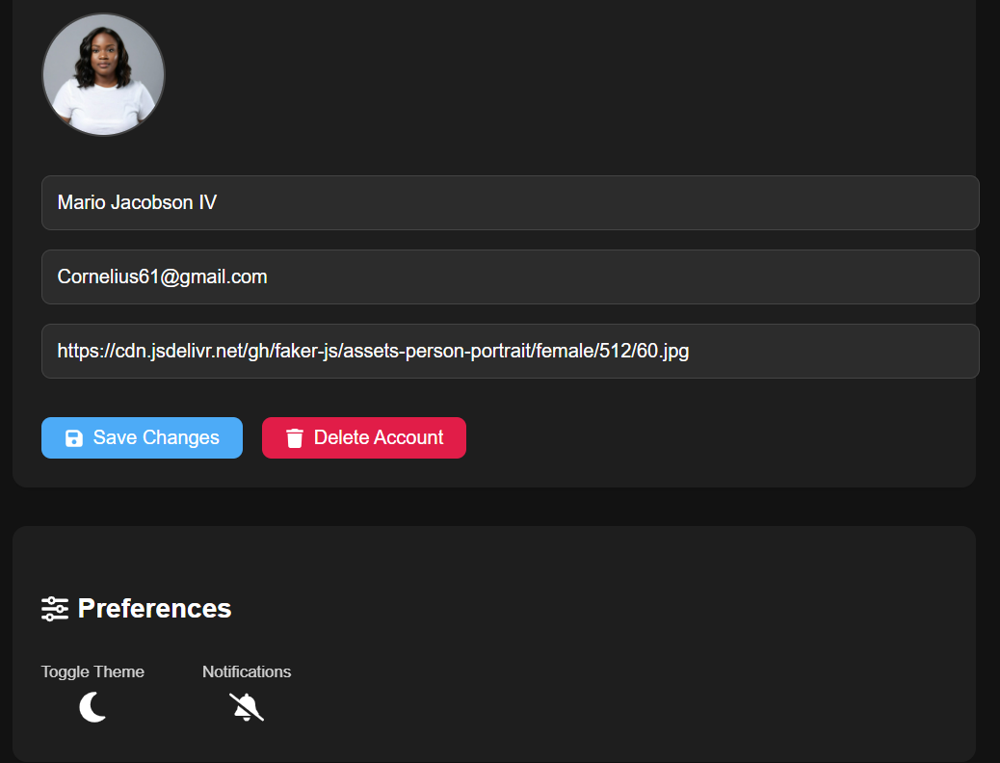
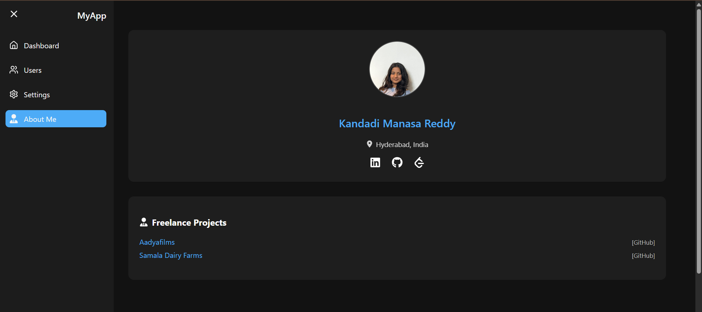
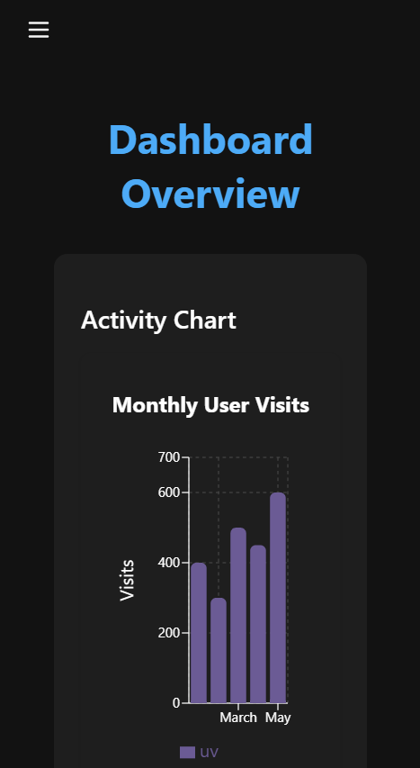
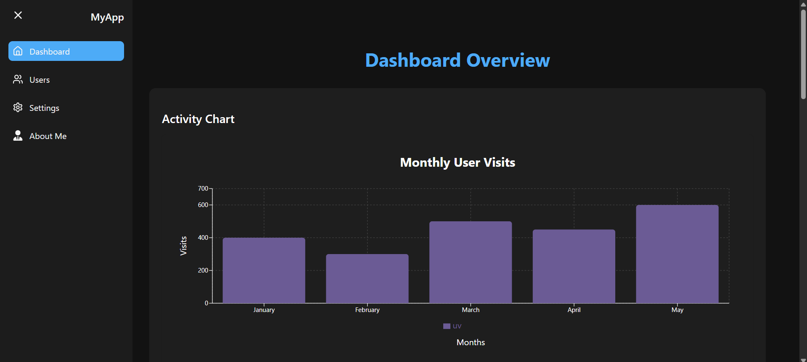
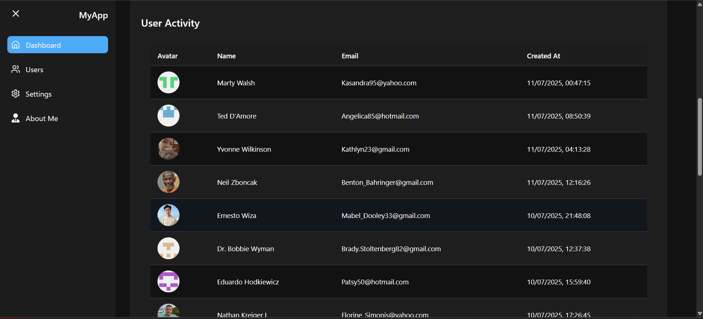
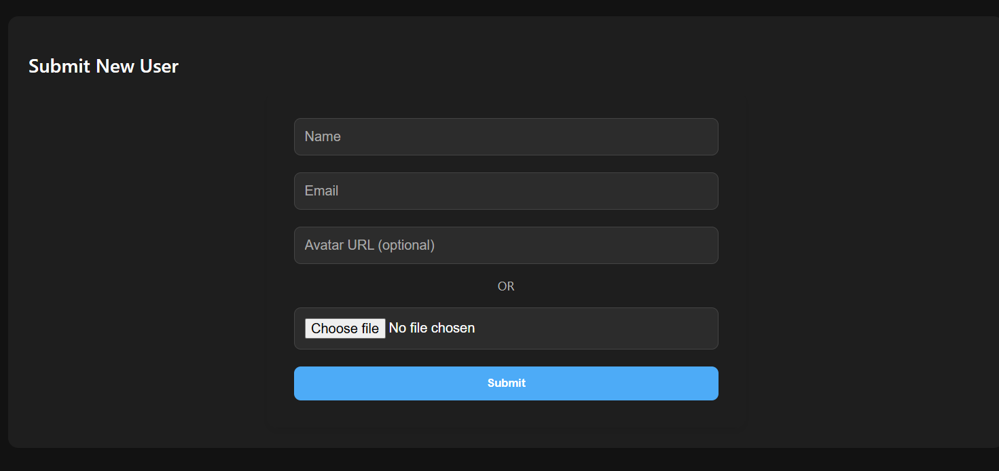
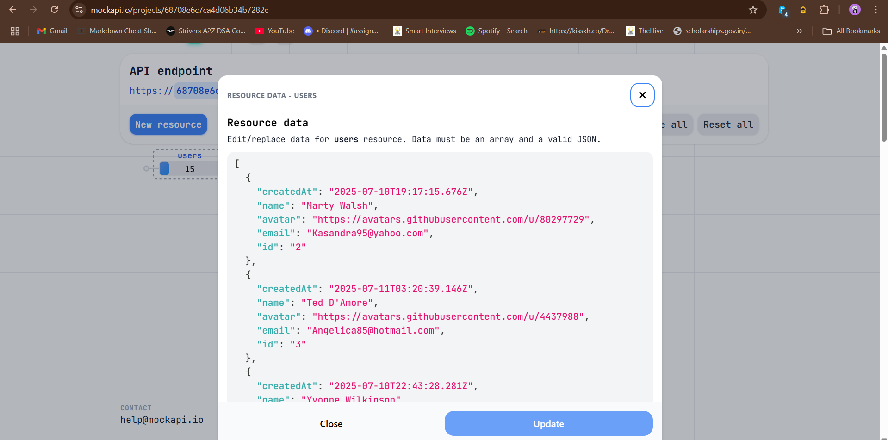
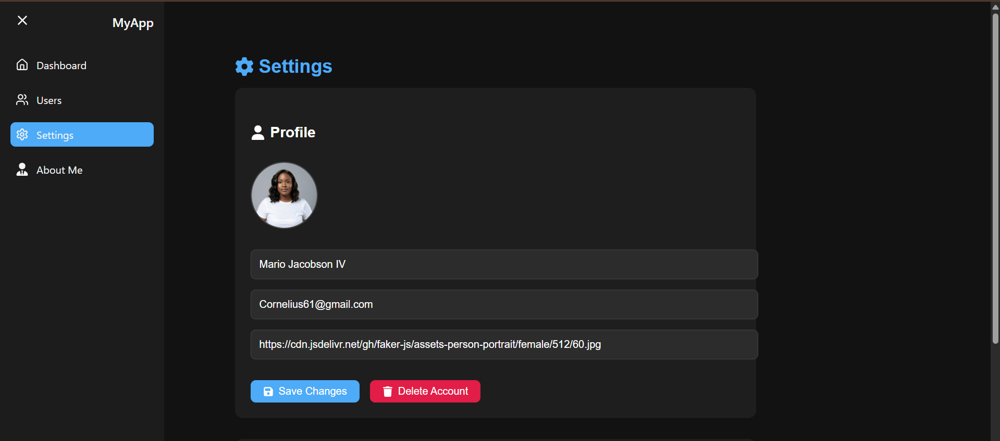

# Datawise Dashboard — Internship Assessment

 Responsive dashboard UI developed using **React + Vite + TypeScript** as part of the **Frontend Developer Internship Assessment**.

**Live Demo:** [https://dashboard-datawise.netlify.app/](https://dashboard-datawise.netlify.app/)

**Mock API** [https://68708e6c7ca4d06b34b7282b.mockapi.io/users](https://68708e6c7ca4d06b34b7282b.mockapi.io/users)

---
---

##  Tech Stack

- **Frontend:** React + Vite
- **Language:** TypeScript
- **State Management:** Context API, useState
- **Styling:** CSS Modules + Theme with CSS Variables
- **Routing:** React Router v6
- **Charting:** Recharts
- **API Calls:** Axios
- **Mock Data Source:** [MockAPI.io](https://mockapi.io)

---

##  How to Run Locally

```bash
# 1. Clone the repository
git clone https://github.com/MANASA-REDDY04/Datawise-Project.git
cd Datawise-Project

# 2. Install dependencies
npm install
npm install requirements.txt

# 3. Run the development server
npm run dev
```

---
##  Features

-  Sidebar with navigation — Dashboard, Users, Settings
-  Bar chart showing mock analytics
-  User table fetched using GET API from MockAPI.io
-  Form with validation and POST API integration
-  Theme toggle — Dark and Light mode
-  React Router for navigation
-  Axios for API requests
-  Fully responsive on all screen sizes

---

##  Screenshots



















